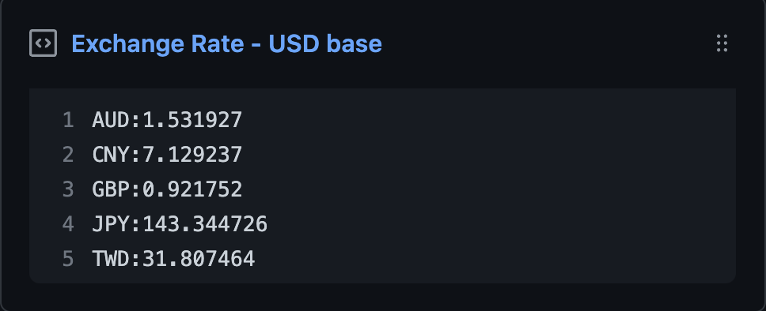

  <h3 align="center">Exchange rate</h3>
  
Update a pinned gist to contain the latest exchange rate

---

> 📌✨ For more pinned-gist projects like this one, check out: https://github.com/matchai/awesome-pinned-gists
## Setup

### Prep work

1. Create a new public GitHub Gist (https://gist.github.com/)
1. Create an access token with the `gist` scope and copy it. (https://github.com/settings/tokens/new)

### Project setup

1. Fork this repo
1. Edit the [environment variables](https://github.com/CHAIYOMIN/exchange-rate/blob/master/.github/workflows/schedule.yml) in `.github/workflows/schedule.yml`:

   - **GIST_ID:** The ID portion from your gist url: `https://gist.github.com/CHAIYOMIN/`**`7001fb269abd6c36cae09ec5a562de88`**.
   - **BASE:** The exchange rate base.(USD,EUR or etc...)
   - **COUNTRY** The exchange rate currency country.

1. Go to the repo **Settings > Secrets**
1. Add the following environment variables:
   - **GH_TOKEN:** The GitHub access token generated above.

## Tools

1. [exchange rate api](https://exchangerate.host/#/)